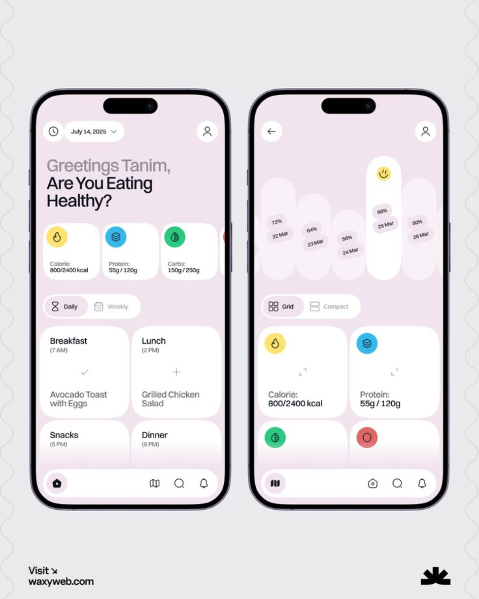

# Unhooked 🧘

> **Unhooked** is a modern, local-first Android digital wellbeing application built with **Kotlin** and **Jetpack Compose**. It helps users intentionally control distracting apps, set daily usage limits, manage schedules, and run deep focus sessions with anti-bypass protections.



---

## ✨ Design & Visual Aesthetics

Inspired by the soft lavender and pastel aesthetic in `125147.jpg`:
- **Palette**: Soft lilac backgrounds (`#F6F2F8`), clean white elevated cards, and pastel accent squircles (Yellow, Cyan, Mint Green, Coral Rose, Lavender Violet).
- **Shapes**: 24dp–28dp rounded cards, 16dp squircle icon backings, and fully rounded 999dp pill controls.
- **Micro-Components**:
  - Segmented capsule pills (`Daily | Weekly`, `Grid | Compact`).
  - Vertical pastel pill consistency charts with percentage tags and best-day indicators (`😊`).
  - Floating rounded bottom navigation dock.
  - Tabular, monospace numerical countdowns for zero drift and stable layout.

---

## 🛡️ Genuine & Safe Architecture (Zero Conflicts)

Unhooked is designed from the ground up to **never conflict with or trigger security warnings in sensitive apps**:

1. **`canRetrieveWindowContent = false`**:
   - In `accessibility_service_config.xml`, Unhooked explicitly declares that it **cannot retrieve window contents**.
   - It only observes the foreground package identifier (`TYPE_WINDOW_STATE_CHANGED`). It cannot see screen text, inputs, passwords, or OTPs.
2. **Permanent Financial & Identity Whitelist (`WhitelistHelper`)**:
   - Built-in, immutable whitelist protecting:
     - **Payment & UPI**: Paytm, Paytm for Business, PhonePe, Google Pay, BHIM, CRED, Navi, MobiKwik.
     - **Government & Identity**: DigiLocker, mAadhaar, UMANG, mParivahan.
     - **Banking**: YONO SBI, HDFC Bank, ICICI iMobile, Axis Mobile, Kotak 811, Bank of Baroda, PNB ONE, Canara ai1.
     - **System Core**: Android Settings, System UI, Phone / Dialer, Emergency SOS, Google Play Services, Permission Controller, and Unhooked itself.
   - When any whitelisted app is detected in foreground, Unhooked exits instantly (0ms execution, zero interference).
3. **No Tapjacking Overlays**:
   - Rather than drawing touch-obscuring overlay windows over other apps (which trip Android's `filterTouchesWhenObscured` security check), Unhooked launches a dedicated standalone activity (`BlockActivity`) on its own task stack.

---

## 🚀 Features

- **Dashboard (Home)**:
  - Daily/Weekly toggle, Overall Screen Time counter vs. allowance, Focus Time, Blocked Attempts.
  - Top Distracting Apps breakdown with usage in minutes.
  - Quick Start 25m focus button.
- **Focus Timer**:
  - Modes: **Countdown**, **Pomodoro** (Focus / Short Break / Long Break), and **Stopwatch**.
  - Absolute timestamp-driven (`endAt = startedAt + duration`) — survives process death and phone reboot without timer drift.
  - Optional Strict Mode lock.
- **App Blocker**:
  - Scan installed launchable applications with live search.
  - Configure daily per-app usage limits (in minutes) or instant blocks.
  - Whitelist viewer highlighting protected apps.
- **Insights & Analytics**:
  - Vertical pastel pill consistency charts showing daily percentages and consistency streaks.
  - Time saved estimate and history of intercepted distraction attempts.
- **Permissions Center**:
  - Real-time status detection for Usage Access, Accessibility Service, Notifications, and Device Administrator.
  - Deep links directly into corresponding Android Settings pages.
- **Anti-Bypass & Strict Mode**:
  - **Normal Mode**: Flexible rule editing.
  - **Password Mode**: Rule modifications require a password/PIN verified via salted SHA-256 hash.
  - **Admin Protection**: Android Device Administrator integration to discourage uninstalling.
  - **Strict Mode**: Locks rules for a committed duration with zero in-app escape route.
- **Block Interruption Screen (`BlockActivity`)**:
  - Calm, mindful message with reason badge and unlock countdown.
  - Safe exit to home screen (`Intent.ACTION_MAIN`).

---

## 🛠️ Project Structure & Architecture

```text
Unhooked/
├── app/
│   ├── build.gradle.kts
│   └── src/
│       ├── main/
│       │   ├── AndroidManifest.xml
│       │   ├── java/com/unhooked/app/
│       │   │   ├── UnhookedApp.kt
│       │   │   ├── MainActivity.kt
│       │   │   ├── domain/
│       │   │   │   ├── model/Models.kt
│       │   │   │   ├── engine/RuleResolver.kt
│       │   │   │   ├── engine/TimerEngine.kt
│       │   │   │   ├── security/SecurityUtil.kt
│       │   │   │   └── whitelist/WhitelistHelper.kt
│       │   │   ├── data/
│       │   │   │   ├── db/AppDatabase.kt
│       │   │   │   ├── db/entities/Entities.kt
│       │   │   │   ├── db/daos/RuleDao.kt, SessionDao.kt, AnalyticsDao.kt
│       │   │   │   ├── preferences/UserPreferencesDataStore.kt
│       │   │   │   └── repository/UnhookedRepository.kt
│       │   │   ├── system/
│       │   │   │   ├── accessibility/AppBlockerAccessibilityService.kt
│       │   │   │   ├── usage/UsageStatsHelper.kt
│       │   │   │   ├── notifications/UnhookedNotificationListenerService.kt
│       │   │   │   ├── deviceadmin/UnhookedAdminReceiver.kt
│       │   │   │   └── boot/BootCompletedReceiver.kt
│       │   │   └── ui/
│       │   │       ├── theme/ (Color.kt, Theme.kt, Type.kt, Shape.kt)
│       │   │       ├── components/ (PastelStatCard, SegmentedPill, PastelPillChart)
│       │   │       ├── navigation/ (Screen.kt, NavGraph.kt, BottomNavBar.kt)
│       │   │       ├── home/ (HomeScreen.kt, HomeViewModel.kt)
│       │   │       ├── focus/ (FocusScreen.kt, FocusViewModel.kt)
│       │   │       ├── block/ (BlockScreen.kt, BlockViewModel.kt)
│       │   │       ├── insights/ (InsightsScreen.kt, InsightsViewModel.kt)
│       │   │       ├── permissions/ (PermissionsScreen.kt, PermissionViewModel.kt)
│       │   │       ├── settings/ (SettingsScreen.kt, AntiBypassScreen.kt, SettingsViewModel.kt)
│       │   │       └── blocked/ (BlockActivity.kt, BlockedScreen.kt)
│       │   └── res/
│       │       ├── values/ (strings.xml, colors.xml, themes.xml)
│       │       ├── xml/ (accessibility_service_config.xml, device_admin.xml)
│       │       └── drawable/ (app icons, vectors)
│       └── test/java/com/unhooked/app/
│           ├── RuleResolverTest.kt
│           ├── TimerEngineTest.kt
│           ├── SecurityUtilTest.kt
│           └── WhitelistHelperTest.kt
├── gradle/
│   ├── libs.versions.toml
│   └── wrapper/
├── build.gradle.kts
├── settings.gradle.kts
└── gradlew, gradlew.bat
```

---

## 💻 Installation & Setup Guide

### 1. Install Android Studio (Recommended)
The easiest way to build, run, and preview the app:
- Open PowerShell and run:
  ```powershell
  winget install Google.AndroidStudio
  ```
  *(Or download from [developer.android.com/studio](https://developer.android.com/studio))*
- Android Studio bundles JDK 17, Android SDK Platform 34/35, Android Emulator, and Live Compose Previews.

### 2. Open Project
1. Launch Android Studio.
2. Select **File &rarr; Open...** and browse to:
   `D:\Coding\Projects\Unhooked`
3. Android Studio will automatically sync the Gradle build and download all dependencies.

### 3. Run on Device / Emulator
1. Connect an Android phone with USB Debugging enabled, or start an Android Virtual Device (AVD).
2. Press **Run (Shift + F10)**.
3. On first launch, open **Permissions Center** in the app to grant Usage Access and Accessibility.
